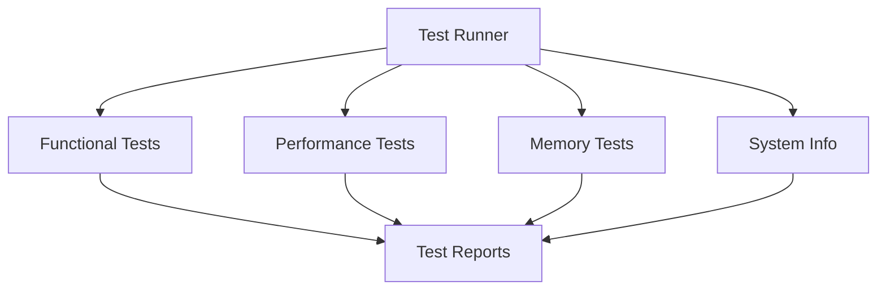

# DAP Testing Guide

This guide documents the testing infrastructure and procedures for the Neovim DAP (Debug Adapter Protocol) configuration.

## Test Components



### 1. Functional Tests (`dap_test.lua`)
- Core functionality validation
- Virtual environment detection
- Framework support testing
- UI integration verification

### 2. Performance Tests (`dap_perf_test.lua`)
- Initialization benchmarks
- Operation timing
- UI responsiveness testing
- Threshold monitoring

### 3. Memory Tests (`dap_mem_test.lua`)
- Memory usage tracking
- Resource monitoring
- Memory leak detection
- Threshold validation

### 4. System Information (`system_info.lua`)
- Environment details
- Plugin versions
- Python configuration
- Resource availability

## Running Tests

### Basic Usage
```lua
-- Run all tests with default configuration
:TestDAPAll

-- Run specific test categories
require('custom.plugins.dap_test').run_all_tests()
require('custom.plugins.dap_perf_test').run_benchmarks()
require('custom.plugins.dap_mem_test').run_memory_benchmarks()
```

### Configuration
```lua
-- Adjust test thresholds
local thresholds = {
  performance = {
    dap_setup = 500,        -- milliseconds
    ui_setup = 200,         -- milliseconds
    venv_detection = 100,   -- milliseconds
    breakpoint_toggle = 50  -- milliseconds
  },
  memory = {
    dap_setup = 5 * 1024 * 1024,      -- 5MB
    ui_setup = 2 * 1024 * 1024,       -- 2MB
    breakpoint_management = 512 * 1024 -- 512KB
  }
}

-- Configure test runner
require('custom.plugins.dap_test_runner').config = {
  setup_delay = 1000,      -- milliseconds
  cleanup = true,          -- clean test artifacts
  verbose = true,          -- detailed output
  check_thresholds = true  -- enforce thresholds
}
```

## Test Reports

### Location
Reports are saved in `test-reports/` with timestamped filenames:
```
test-reports/
  └── dap_test_report_20250304_125423.md
```

### Report Sections
1. System Information
   - Neovim version
   - Plugin versions
   - Python environment
   - System resources

2. Test Summary
   - Execution time
   - Test count
   - Failure count

3. Functional Tests
   - Test cases
   - Pass/fail status
   - Details/errors

4. Performance Tests
   - Operation timings
   - Threshold comparisons
   - Performance alerts

5. Memory Usage
   - Lua memory
   - Process memory
   - Threshold violations

6. Recommendations
   - Performance improvements
   - Memory optimizations
   - Configuration adjustments

## Framework-Specific Testing

### Django Projects
```lua
-- Configure Django test environment
local function setup_django_env()
  vim.fn.setenv('DJANGO_SETTINGS_MODULE', 'myproject.settings')
  -- Additional Django setup
end

-- Run Django-specific tests
local django_tests = {
  setup = setup_django_env,
  tests = {
    test_django_debugger = function()
      -- Test implementation
    end
    -- Additional tests
  }
}
```

### Flask Projects
```lua
-- Configure Flask test environment
local function setup_flask_env()
  vim.fn.setenv('FLASK_APP', 'app.py')
  vim.fn.setenv('FLASK_ENV', 'development')
  -- Additional Flask setup
end

-- Run Flask-specific tests
local flask_tests = {
  setup = setup_flask_env,
  tests = {
    test_flask_debugger = function()
      -- Test implementation
    end
    -- Additional tests
  }
}
```

## Troubleshooting

### Common Issues
1. Virtual Environment Detection
   - Ensure `VIRTUAL_ENV` is set
   - Check Python path configuration
   - Verify debugpy installation

2. Performance Issues
   - Review system resources
   - Check concurrent operations
   - Validate configuration

3. Memory Issues
   - Monitor memory usage
   - Check for memory leaks
   - Adjust garbage collection

### Debug Mode
```lua
-- Enable debug logging
vim.g.dap_log_level = 'DEBUG'

-- Track detailed performance metrics
require('custom.plugins.dap_perf_test').config.detailed = true

-- Monitor memory allocation
require('custom.plugins.dap_mem_test').config.track_allocations = true
```

## Best Practices

1. Regular Testing
   - Run tests before commits
   - Monitor performance trends
   - Track memory usage

2. Configuration Management
   - Version control test configs
   - Document threshold changes
   - Maintain baseline metrics

3. Report Analysis
   - Review test reports regularly
   - Track performance trends
   - Address recommendations

4. Environment Setup
   - Use clean test environments
   - Isolate framework tests
   - Reset between test runs