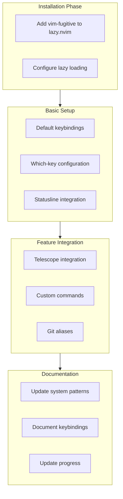

# Git Integration Implementation Plan

## Overview
Integrating vim-fugitive with enhanced features and integrations for an optimal Git workflow in Neovim.

## Implementation Plan

## Implementation Steps

1. Plugin Configuration
   - Install vim-fugitive via lazy.nvim
   - Configure lazy loading on Git-related commands
   - Set up statusline integration for Git status

2. Which-Key Integration
   - Create Git command group under `<leader>g`
   - Map essential Git operations
   - Add descriptive command documentation

3. Telescope Integration
   - Configure Git file navigation
   - Set up branch/commit browsing
   - Implement custom Git pickers

4. Custom Commands and Aliases
   - Configure common Git workflows
   - Set up custom commands for frequent operations
   - Integrate with existing keybinding patterns

## Next Steps
- Review implementation plan with team
- Create Git integration module in plugins directory
- Update system documentation

## Success Criteria
- [x] Confirm plan aligns with existing architecture
- [ ] Implement core Git functionality
- [ ] Configure all integrations
- [ ] Test all Git operations
- [ ] Update documentation