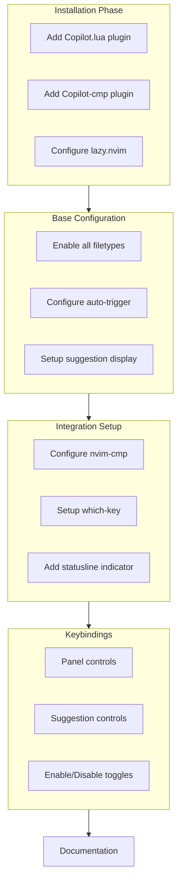

# GitHub Copilot Integration Plan

## Overview
Implementing GitHub Copilot with full integration into Neovim, including completion, which-key support, and custom keybindings.

## Implementation Plan



## Components

1. Core Plugins:
   - github/copilot.vim (main plugin)
   - zbirenbaum/copilot-cmp (completion integration)

2. Feature Configuration:
   - Automatic suggestions in all filetypes
   - Manual trigger support
   - Integration with nvim-cmp
   - Statusline integration

3. Which-key Integration:
   ```
   <leader>c - Copilot commands
   ├── t - Toggle Copilot
   ├── n - Next suggestion
   ├── p - Previous suggestion
   ├── s - Suggest now
   ├── a - Accept suggestion
   └── d - Dismiss suggestion
   ```

4. Additional Features:
   - Statusline Git integration
   - Multi-suggestion panel
   - Custom commands
   - Suggestion preview customization

## Next Steps
1. Create copilot.lua plugin file
2. Configure nvim-cmp integration
3. Set up keybindings
4. Add statusline support
5. Test and verify functionality

## Success Criteria
- [ ] Copilot suggestions working in all file types
- [ ] Both automatic and manual triggers functional
- [ ] Which-key integration complete
- [ ] nvim-cmp integration working
- [ ] Statusline showing Copilot status