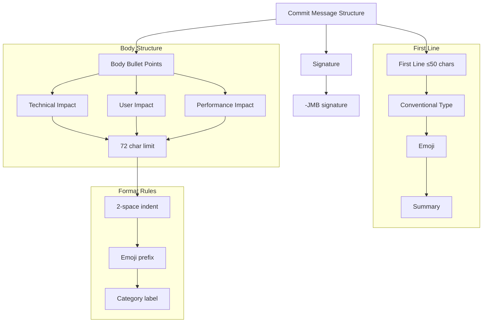

# Copilot Git Commit Message Template

## Message Structure



## Commit Types and Emojis

| Type     | Emoji | Description     |
|----------|-------|-----------------|
| feat     | ✨    | New features    |
| fix      | 🐛    | Bug fixes      |
| docs     | 📝    | Documentation  |
| style    | 💄    | Code style     |
| refactor | ♻️    | Refactoring    |
| test     | ✅    | Testing        |
| chore    | 🔧    | Maintenance    |

## Category-Specific Emojis

### Technical Impact
- 🔧 Infrastructure changes
- 🛠️ Implementation details
- ⚙️ System modifications

### User Impact
- 💡 User experience
- 👥 User interface
- 🎯 User workflow

### Performance Impact
- ⚡ Speed improvements
- 🚀 Optimizations
- 📊 Metrics

## Template Format

```
type(scope): 🎯 Brief description (≤50 chars)

Technical:
  • 🔧 Implementation detail (≤72 chars)
User Impact:
  • 💡 User-facing change (≤72 chars)
Performance:
  • ⚡ Performance impact (≤72 chars)

-JMB
```

## Validation Rules

1. First line must be ≤50 characters
2. Must use valid conventional commit type
3. Bullet points must be ≤72 characters
4. Must include 2-3 categorized bullet points
5. Must use appropriate category emojis
6. Must end with "-JMB" signature
7. Categories must be properly indented (2 spaces)