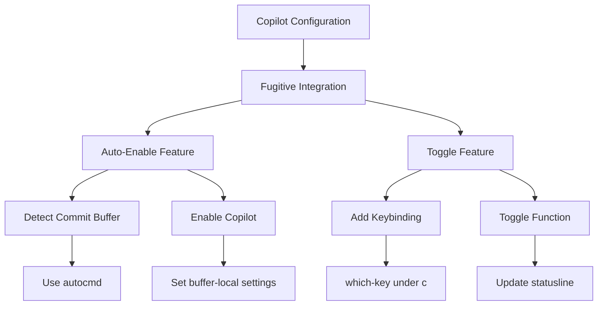

# Copilot Git Integration Plan

## Overview
Implement Copilot integration with git commit messages through fugitive.vim, providing both automatic activation and manual toggle capability.

## Implementation Flow

## Implementation Steps

1. Update Copilot Plugin Configuration:
   - Add autocmd for git commit buffers
   - Create buffer-local settings
   - Implement toggle functionality
   - Add which-key mapping under existing '<leader>c' group

2. Buffer Detection:
   - Monitor for fugitive's COMMIT_EDITMSG buffer
   - Check for commit message filetypes
   - Handle different commit scenarios (commit, merge, rebase)

3. Copilot Settings:
   - Enable by default for commit messages
   - Configure suggestion behavior
   - Set up buffer-specific options
   - Preserve existing Copilot settings

4. Key Mappings:
   - Add toggle to '<leader>c' group
   - Create buffer-local mappings
   - Integrate with existing Copilot commands

5. Status Indicators:
   - Show Copilot status in commit buffer statusline
   - Use existing statusline robot emoji (🤖)
   - Add commit-specific indicator
   - Update on toggle

## Success Criteria
- Copilot automatically activates in git commit messages
- Toggle works via '<leader>c' mapping in commit buffers
- Status is visible in statusline with robot emoji
- Existing Copilot functionality remains unchanged
- Integration fits within existing which-key structure

## Implementation Notes
- Use existing statusline integration from copilot.lua
- Extend current which-key group instead of creating new one
- Maintain consistent visual feedback with main Copilot features