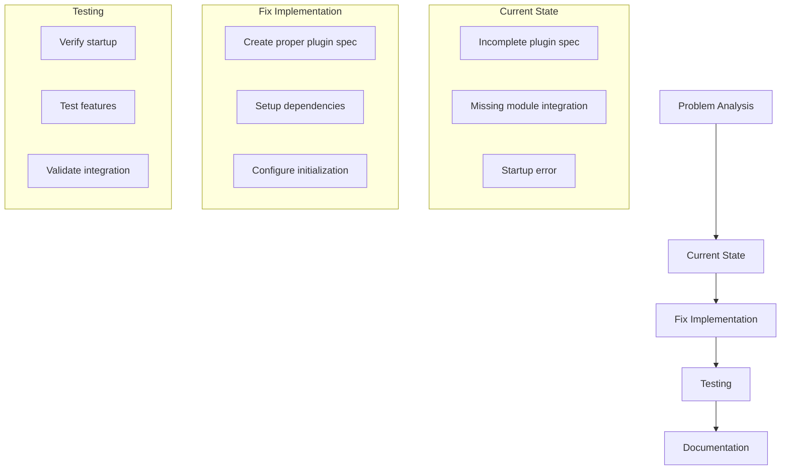

# Commit Template Plugin Fix Plan

## Current Issue
- Invalid plugin specification in init.lua causing startup error
- Incomplete table structure for commit template configuration
- Error occurs during Neovim startup

## Solution Architecture


## Implementation Steps

1. Plugin Specification
```lua
{
  "custom/commit-template",
  event = "VimEnter",
  dependencies = {
    "nvim-lua/plenary.nvim",
    "github/copilot.vim",
  },
  dir = vim.fn.stdpath("config") .. "/lua/custom/plugins",
  config = function()
    require("custom.plugins.copilot_commit").setup()
  end,
}
```

2. Module Loading Sequence
- Load commit_template.lua first
- Initialize copilot_commit.lua after dependencies
- Handle table initialization properly

3. Error Handling
- Graceful fallback if Copilot isn't available
- Clear error messages for troubleshooting
- Proper module loading sequence

## Implementation Notes
- Requires modifying Lua files
- Changes needed in init.lua
- Dependencies must be properly configured
- Error handling needs to be robust

## Testing Requirements
1. Startup Validation
   - Clean Neovim start
   - No error messages
   - Plugin loads correctly

2. Feature Testing
   - Commit template generation
   - Emoji support
   - Integration with Copilot

## Success Criteria
- No startup errors
- Complete plugin specification
- Working commit template functionality
- Proper error handling