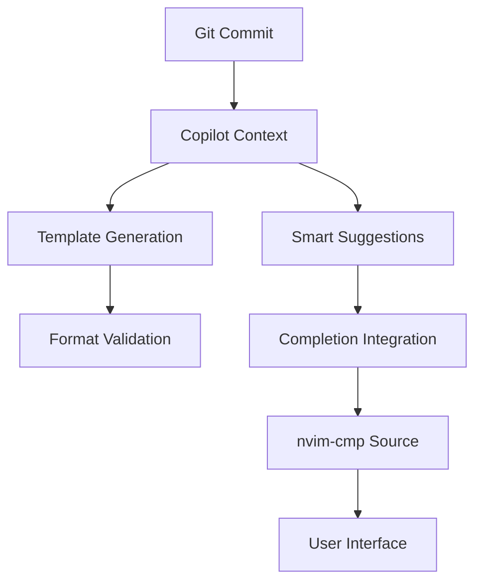

# GitHub Copilot Integration Guide

## Architecture Overview



## Integration Components

1. **Copilot Context Provider**
   - Branch information
   - Changed files
   - Commit history
   - Project patterns

2. **Smart Suggestions**
   - Commit type detection
   - Impact analysis
   - Technical details
   - User-facing changes

3. **Completion Integration**
   - Custom nvim-cmp source
   - Priority handling
   - Context filtering
   - Real-time updates

## Configuration Options

```lua
-- Example configuration
{
  copilot = {
    suggestion_priority = 100,
    enable_commit_suggestions = true,
    context_lines = 5,
    filter_irrelevant = true
  }
}
```

## Implementation Details

1. **Initialization**
   - Automatic setup on git commit
   - Context gathering
   - Template application
   - Copilot activation

2. **Suggestion Flow**
   - Get changed files context
   - Analyze impact scope
   - Generate smart suggestions
   - Filter and prioritize

3. **User Interface**
   - Real-time completions
   - Inline suggestions
   - Validation feedback
   - Template controls

## Usage Examples

### Basic Commit Flow
1. Start commit message
2. Get Copilot suggestions
3. Select appropriate suggestions
4. Validate format
5. Complete commit

### Advanced Features
- Custom template modifications
- Context-aware suggestions
- Impact analysis integration
- Performance optimization

## Best Practices

1. **Template Usage**
   - Follow conventional commits
   - Include all required sections
   - Use appropriate emojis
   - Keep format consistent

2. **Performance**
   - Enable caching
   - Optimize context size
   - Limit suggestion count
   - Use lazy loading

3. **Integration**
   - Maintain modular structure
   - Follow nvim-cmp patterns
   - Handle errors gracefully
   - Document changes

## Testing Strategy

1. **Unit Tests**
   - Context gathering
   - Suggestion filtering
   - Template validation
   - Completion integration

2. **Integration Tests**
   - End-to-end flows
   - UI interactions
   - Error handling
   - Performance metrics

## Troubleshooting

Common issues and solutions:
1. Slow suggestions
   - Reduce context size
   - Enable caching
   - Optimize filters

2. Invalid completions
   - Check template format
   - Verify context data
   - Update Copilot version

3. Integration errors
   - Verify dependencies
   - Check configuration
   - Update components