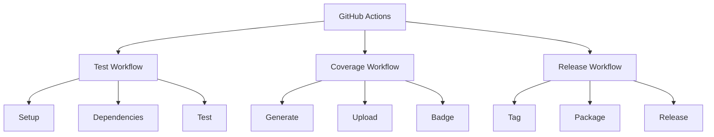

# GitHub Actions Configuration

## Overview



## Test Workflow

```yaml
# .github/workflows/test.yml
name: Tests

on:
  push:
    branches: [main]
  pull_request:
    branches: [main]

jobs:
  test:
    name: Neovim ${{ matrix.neovim }} on ${{ matrix.os }}
    runs-on: ${{ matrix.os }}
    strategy:
      fail-fast: false
      matrix:
        os: [ubuntu-latest]
        neovim: ['stable', 'nightly']

    steps:
      - uses: actions/checkout@v3

      - name: Install Neovim
        uses: rhysd/action-setup-vim@v1
        with:
          neovim: true
          version: ${{ matrix.neovim }}

      - name: Install LuaCov
        run: |
          sudo apt-get update
          sudo apt-get install -y luarocks
          sudo luarocks install luacov
          sudo luarocks install luacov-console
          sudo luarocks install luacov-reporter-lcov

      - name: Run Tests
        run: |
          make test
        env:
          NVIM_TEST: 1

      - name: Generate Coverage
        run: |
          make coverage
          lcov --capture --directory . --output-file coverage.info

      - name: Upload Coverage
        uses: codecov/codecov-action@v3
        with:
          files: ./coverage.info
          fail_ci_if_error: true

      - name: Update Badge
        if: github.ref == 'refs/heads/main'
        uses: schneegans/dynamic-badges-action@v1.6.0
        with:
          auth: ${{ secrets.GIST_SECRET }}
          gistID: coverage_badge_gist_id
          filename: coverage.json
          label: coverage
          message: ${{ env.COVERAGE }}
          color: ${{ env.COVERAGE_COLOR }}
```

## Coverage Configuration

```yaml
# .github/codecov.yml
coverage:
  status:
    project:
      default:
        target: 90%
        threshold: 1%
    patch:
      default:
        target: 95%
        threshold: 1%

ignore:
  - "tests/**/*"
  - "**/minimal_init.lua"
```

## Badge Configuration

```yaml
# .github/badges.yml
coverage:
  gist_id: coverage_badge_gist_id
  ranges:
    - from: 0
      to: 60
      color: red
    - from: 60
      to: 80
      color: yellow
    - from: 80
      to: 90
      color: yellowgreen
    - from: 90
      to: 100
      color: brightgreen
```

## Environment Setup

Required repository secrets:
- `GIST_SECRET`: GitHub token with gist access for badge updates
- `CODECOV_TOKEN`: Codecov.io upload token

## Local Testing

Test the GitHub Actions workflow locally using [act](https://github.com/nektos/act):

```bash
# Install act
brew install act

# Run the test workflow
act -j test

# Run with specific event
act pull_request

# Run with specific Neovim version
act -j test --matrix neovim:stable
```

## CI/CD Pipeline Steps

1. **Setup Phase**
   - Checkout code
   - Install Neovim
   - Setup dependencies
   - Configure environment

2. **Test Phase**
   - Run test suite
   - Generate coverage
   - Upload results
   - Update badges

3. **Release Phase**
   - Create tag
   - Build package
   - Create release
   - Upload artifacts

## Integration Points

- **Pull Requests**: Run tests and coverage
- **Main Branch**: Update badges and documentation
- **Tags**: Create releases

## Success Criteria

1. All tests pass
2. Coverage meets targets:
   - Project: 90%
   - Patch: 95%
3. Documentation updated
4. Badges reflect current status

Would you like me to proceed with creating any other specifications, or shall we switch to Code mode to begin implementation?