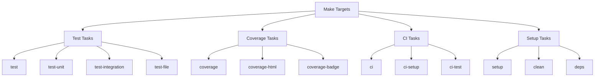

# Makefile Specification

## Overview

The Makefile will handle all test-related tasks and CI/CD automation.



## Core Targets

```makefile
# Core variables
PLUGIN_ROOT = lua/custom/plugins
TEST_DIR = $(PLUGIN_ROOT)/tests
NVIM = nvim
NVIM_TEST = NVIM_TEST=1 $(NVIM)
PLENARY = $(PLUGIN_ROOT)/pack/vendor/start/plenary.nvim

# Main test targets
.PHONY: test test-unit test-integration test-file coverage setup clean deps

# Run all tests
test: deps
    $(NVIM_TEST) --headless -c "PlenaryBustedDirectory $(TEST_DIR)/specs/ {minimal_init = '$(TEST_DIR)/minimal_init.lua'}"

# Run unit tests only
test-unit: deps
    $(NVIM_TEST) --headless -c "PlenaryBustedDirectory $(TEST_DIR)/specs/unit/ {minimal_init = '$(TEST_DIR)/minimal_init.lua'}"

# Run integration tests only
test-integration: deps
    $(NVIM_TEST) --headless -c "PlenaryBustedDirectory $(TEST_DIR)/specs/integration/ {minimal_init = '$(TEST_DIR)/minimal_init.lua'}"

# Run specific test file
test-file: deps
    @[ "$(FILE)" ] && $(NVIM_TEST) --headless -c "PlenaryBustedFile $(FILE)"

# Coverage targets
coverage: deps
    $(NVIM_TEST) --headless -c "lua require('luacov').start()" \
        -c "PlenaryBustedDirectory $(TEST_DIR)/specs/" \
        -c "lua require('luacov').stop()" \
        -c "lua require('luacov-console')('default')" \
        -c "q"

coverage-html: coverage
    luacov-html
    @echo "Coverage report generated in coverage/report.html"

coverage-badge: coverage
    @luacov-badge -u

# CI targets
ci: ci-setup ci-test coverage-badge

ci-setup: deps
    @echo "Setting up CI environment..."

ci-test:
    @echo "Running CI test suite..."
    $(MAKE) test

# Setup targets
setup: deps
    @echo "Setting up test environment..."
    mkdir -p $(TEST_DIR)/{specs,helpers}

clean:
    rm -rf coverage
    rm -f luacov.*
    rm -f .luacov.stats.out

deps:
    @[ -d "$(PLENARY)" ] || git clone https://github.com/nvim-lua/plenary.nvim.git $(PLENARY)
```

## Usage Examples

### Local Development

```bash
# Run all tests
make test

# Run specific test file
make test-file FILE=lua/custom/plugins/tests/specs/commit_template_spec.lua

# Generate coverage report
make coverage-html

# Clean up
make clean
```

### CI/CD Pipeline

```bash
# Full CI run with coverage
make ci

# Setup only
make ci-setup

# Tests only
make ci-test
```

## Dependencies

Required tools:
- GNU Make
- LuaCov
- LuaCov-html (for HTML reports)
- LuaCov-console (for terminal output)
- plenary.nvim (fetched automatically)

## Integration with GitHub Actions

The Makefile targets align with the GitHub Actions workflow:

```yaml
test:
  runs-on: ubuntu-latest
  steps:
    - uses: actions/checkout@v3
    - name: Setup
      run: make ci-setup
    - name: Test
      run: make ci-test
    - name: Coverage
      run: make coverage-badge
```

Would you like me to proceed with creating the test helper files and actual implementation?