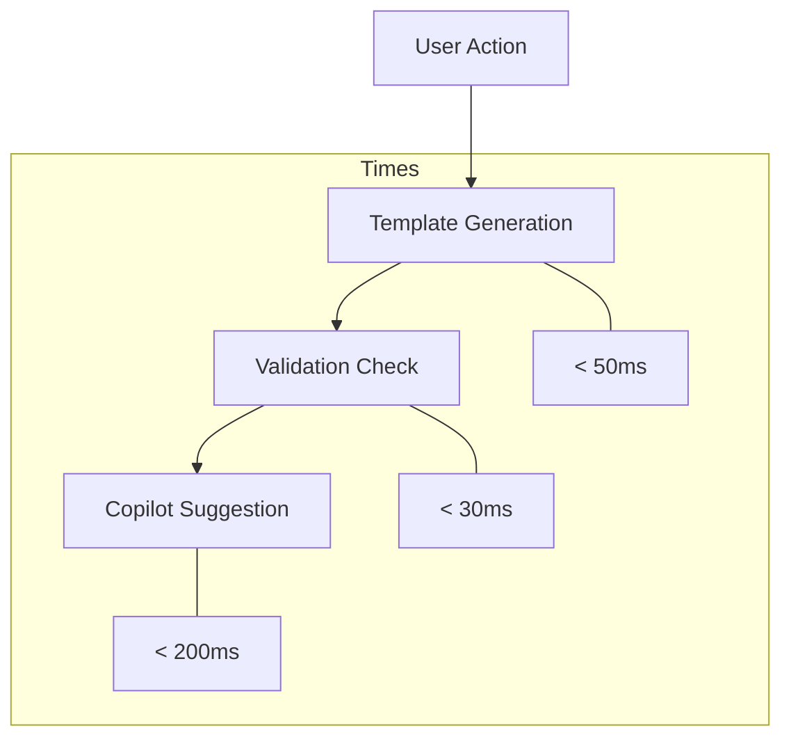

# Performance Specifications

## Response Time Requirements

## Performance Targets

### Core Operations
1. **Template Management**
   - Generation: < 50ms
   - Validation: < 30ms
   - Buffer updates: < 20ms
   - Cache operations: < 10ms

2. **Copilot Integration**
   - Context gathering: < 100ms
   - Suggestion fetch: < 200ms
   - Completion insert: < 50ms
   - Cache hits: > 90%

3. **Buffer Operations**
   - Line insertions: < 10ms
   - Content updates: < 20ms
   - Event handling: < 15ms
   - State changes: < 5ms

## Memory Management

### Resource Limits
1. **Static Memory**
   - Template cache: < 1MB
   - Emoji mappings: < 100KB
   - Configuration: < 50KB
   - Helper functions: < 200KB

2. **Dynamic Memory**
   - Active buffers: < 5MB
   - Copilot context: < 2MB
   - Suggestion cache: < 1MB
   - Event queues: < 500KB

3. **Total Impact**
   - Idle state: < 5MB
   - Active usage: < 10MB
   - Peak load: < 15MB
   - Cache limit: < 20MB

## Optimization Strategies

### Caching System
1. **Template Cache**
   - In-memory storage
   - LRU eviction
   - Pre-compilation
   - Lazy loading

2. **Suggestion Cache**
   - Context-based keys
   - TTL expiration
   - Partial matches
   - Background refresh

3. **Buffer Cache**
   - Line-based storage
   - Change tracking
   - Incremental updates
   - State persistence

### Event Handling
1. **Debouncing**
   - Validation: 300ms
   - Suggestions: 500ms
   - Updates: 100ms
   - Feedback: 50ms

2. **Batching**
   - Buffer changes
   - Validation checks
   - Cache updates
   - State changes

3. **Async Operations**
   - Copilot calls
   - Heavy validation
   - Cache updates
   - State persistence

## Monitoring

### Key Metrics
1. **Response Times**
   - Operation latency
   - Cache performance
   - Event handling
   - API responses

2. **Memory Usage**
   - Static allocation
   - Dynamic growth
   - Cache size
   - Buffer state

3. **System Impact**
   - CPU usage
   - Memory pressure
   - I/O operations
   - Event queue size

### Performance Testing
1. **Benchmark Suite**
   - Core operations
   - Integration flows
   - Memory patterns
   - Load scenarios

2. **Continuous Monitoring**
   - Response times
   - Memory usage
   - Cache efficiency
   - Error rates

3. **Load Testing**
   - Concurrent operations
   - Large repositories
   - Extended sessions
   - Error conditions