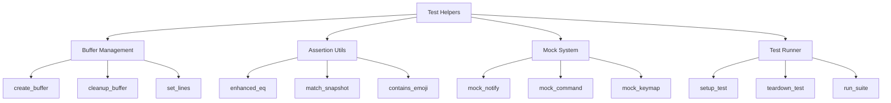

# Test Helper Modules Specification

## Overview



## Module Structure

### 1. Main Helper (`helpers/init.lua`)
```lua
local M = {
  buffer = require('tests.helpers.buffer'),
  assert = require('tests.helpers.assert'),
  mock = require('tests.helpers.mock'),
  runner = require('tests.helpers.runner')
}

-- Global test state
_G.test_state = {
  buffers = {},
  mocks = {
    notify = {},
    commands = {},
    keymaps = {}
  },
  snapshots = {}
}

-- Setup/Teardown
M.setup = function(opts)
  -- Initialize test environment
  -- Load required plugins
  -- Configure paths
end

M.cleanup = function()
  -- Clean buffers
  -- Reset mocks
  -- Clear state
end

return M
```

### 2. Buffer Management (`helpers/buffer.lua`)
```lua
local M = {}

-- Buffer creation with options
M.create = function(opts)
  -- Create new buffer
  -- Set options
  -- Track in state
end

-- Buffer cleanup
M.cleanup = function(bufnr)
  -- Remove from state
  -- Delete buffer
end

-- Content manipulation
M.set_lines = function(bufnr, content)
  -- Handle string/table input
  -- Update buffer content
end

return M
```

### 3. Enhanced Assertions (`helpers/assert.lua`)
```lua
local M = {}

-- Deep equality with detailed diffs
M.equals = function(expected, actual, msg)
  -- Compare values
  -- Generate diff on failure
end

-- Snapshot testing
M.matches_snapshot = function(value, name)
  -- Load/create snapshot
  -- Compare and update
end

-- Custom matchers
M.contains_emoji = function(str)
  -- Validate emoji presence
end

return M
```

### 4. Mock System (`helpers/mock.lua`)
```lua
local M = {}

-- Notification mocking
M.notify = function()
  -- Track notifications
  -- Provide inspection API
end

-- Command mocking
M.command = function(name, impl)
  -- Register mock command
  -- Track invocations
end

-- Keymap mocking
M.keymap = function(mode, lhs, rhs)
  -- Register mock mapping
  -- Track usage
end

return M
```

### 5. Test Runner (`helpers/runner.lua`)
```lua
local M = {}

-- Individual test setup
M.setup_test = function(opts)
  -- Prepare environment
  -- Load dependencies
  -- Initialize state
end

-- Test cleanup
M.teardown_test = function()
  -- Clean environment
  -- Reset state
  -- Clear mocks
end

-- Suite execution
M.run_suite = function(path, opts)
  -- Load test files
  -- Execute tests
  -- Report results
end

return M
```

## Usage Examples

### 1. Basic Test Setup
```lua
local helpers = require('tests.helpers')

describe("feature", function()
  local buffer

  before_each(function()
    helpers.setup()
    buffer = helpers.buffer.create()
  end)

  after_each(function()
    helpers.buffer.cleanup(buffer)
    helpers.cleanup()
  end)

  it("should work", function()
    -- Test implementation
  end)
end)
```

### 2. Mock Usage
```lua
local mock = require('tests.helpers.mock')

it("handles notifications", function()
  local notify = mock.notify()
  -- Trigger notification
  assert.equals(1, #notify.calls)
  assert.matches("error", notify.calls[1].level)
end)
```

### 3. Enhanced Assertions
```lua
local assert = require('tests.helpers.assert')

it("matches expected output", function()
  assert.matches_snapshot(result, "feature_output")
  assert.contains_emoji("feat: ✨ Add feature")
end)
```

## Testing Standards

1. **Setup/Teardown**
   - Always use helper functions
   - Clean up resources properly
   - Maintain test isolation

2. **Assertions**
   - Use enhanced assertions
   - Include meaningful messages
   - Check specific conditions

3. **Mocking**
   - Mock external dependencies
   - Verify mock interactions
   - Reset mocks between tests