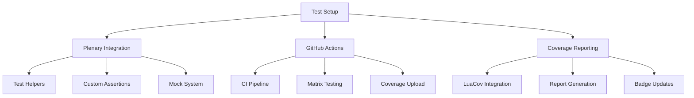

# Test Infrastructure Architecture

## Overview



## Core Components

### 1. Test Environment
```
lua/custom/plugins/
├── tests/
│   ├── minimal_init.lua       # Minimal Neovim config for tests
│   ├── helpers/
│   │   ├── init.lua          # Main test helper module
│   │   ├── assert.lua        # Custom assertions
│   │   ├── buffer.lua        # Buffer manipulation
│   │   ├── mock.lua          # Mocking utilities
│   │   └── coverage.lua      # Coverage helpers
│   └── specs/               # Test specifications
```

### 2. Plenary Integration

#### Test Runner Setup
```lua
-- minimal_init.lua
-- Dependencies
require('plenary')
require('plenary.test_harness')

-- Plugin setup
local plugin_root = vim.fn.stdpath('data') .. '/plugins'
vim.opt.rtp:append(plugin_root .. '/plenary.nvim')
vim.opt.rtp:append(plugin_root .. '/nvim-cmp')
```

#### Helper Utilities
```lua
-- helpers/init.lua
local M = {
  buffer = require('tests.helpers.buffer'),
  assert = require('tests.helpers.assert'),
  mock = require('tests.helpers.mock'),
  coverage = require('tests.helpers.coverage')
}

M.setup = function()
  -- Setup test environment
end

M.cleanup = function()
  -- Cleanup after tests
end

return M
```

### 3. GitHub Actions

```yaml
name: Tests
on: [push, pull_request]

jobs:
  test:
    runs-on: ubuntu-latest
    strategy:
      matrix:
        neovim_version: ['stable', 'nightly']

    steps:
      - uses: actions/checkout@v3
      - uses: rhysd/action-setup-vim@v1
        with:
          neovim: true
          version: ${{ matrix.neovim_version }}
      - name: Run Tests
        run: make test
      - name: Upload Coverage
        uses: codecov/codecov-action@v3
```

### 4. Coverage Integration

#### LuaCov Configuration
```lua
-- .luacov
return {
  include = {
    'lua/custom/plugins/',
  },
  exclude = {
    'lua/custom/plugins/tests/',
  },
  reporter = 'html',
  html = {
    output = 'coverage/report.html',
  }
}
```

#### Coverage Reporting
- HTML reports in coverage/
- Badge integration with shields.io
- Codecov integration for PR reviews

## Testing Standards

### 1. Unit Tests
- Pure function testing
- Mock external dependencies
- High coverage requirements (>90%)

### 2. Integration Tests
- Buffer operations
- Plugin interactions
- Command execution
- Event handling

### 3. Completion Tests
- Source registration
- Item generation
- Trigger behavior
- Documentation formatting

## Test Command Integration

### Local Development
```bash
# Run all tests
make test

# Run specific test file
nvim --headless -c "PlenaryBustedFile lua/custom/plugins/tests/specs/commit_template_spec.lua"

# Generate coverage report
make coverage
```

### CI/CD Integration
```bash
# CI test execution
NVIM_TEST=1 nvim --headless -c "PlenaryBustedDirectory lua/custom/plugins/tests/specs/ {minimal_init = 'tests/minimal_init.lua'}"

# Coverage report generation
luacov && luacov-console && luacov-html
```

## Implementation Plan

1. **Phase 1: Basic Infrastructure**
   - Set up minimal_init.lua
   - Create test helper framework
   - Implement basic mocks

2. **Phase 2: GitHub Actions**
   - Configure CI pipeline
   - Set up matrix testing
   - Add coverage reporting

3. **Phase 3: Test Implementation**
   - Convert existing tests
   - Add missing coverage
   - Implement new test cases

4. **Phase 4: Documentation**
   - Write test guidelines
   - Document helper functions
   - Add example test cases