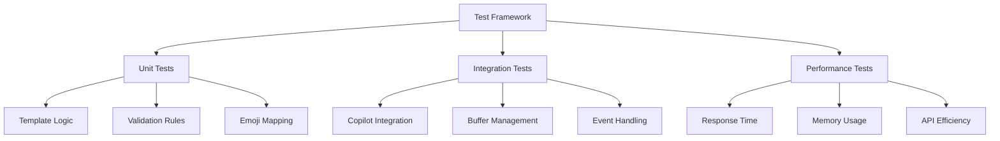

# Test Strategy

## Testing Architecture



## Test Categories

### Unit Tests
1. **Template Processing**
   - Template generation
   - Section validation
   - Character limits
   - Format rules

2. **Copilot Integration**
   - Context gathering
   - Suggestion filtering
   - Completion handling
   - Error scenarios

3. **Buffer Management**
   - Content insertion
   - Line operations
   - Event triggers
   - State management

### Integration Tests
1. **Git Operations**
   - Commit message flow
   - Buffer initialization
   - Template application
   - Validation checks

2. **Copilot Features**
   - Suggestion quality
   - Context relevance
   - Completion accuracy
   - Error handling

3. **UI Components**
   - Status messages
   - Error displays
   - Keybindings
   - Command execution

### Performance Tests
1. **Response Times**
   - Template generation: < 50ms
   - Validation checks: < 30ms
   - Copilot suggestions: < 200ms
   - Buffer operations: < 20ms

2. **Memory Usage**
   - Template cache: < 1MB
   - Active buffers: < 5MB
   - Suggestion storage: < 2MB
   - Total impact: < 10MB

3. **API Efficiency**
   - Copilot calls: < 3 per commit
   - Git operations: < 100ms
   - Event handlers: < 10ms
   - Cache hits: > 90%

## Test Implementation

### Helper Functions
1. **Buffer Simulation**
   ```lua
   -- Buffer management helpers
   function setup_buffer(content)
   function get_buffer_content()
   function simulate_changes(changes)
   ```

2. **Copilot Mocks**
   ```lua
   -- Copilot interaction mocks
   function mock_suggestions(context)
   function simulate_completion(input)
   function fake_api_response(query)
   ```

3. **Validation Tools**
   ```lua
   -- Test validation helpers
   function verify_template(content)
   function check_format(message)
   function assert_valid_commit(text)
   ```

## Test Coverage Goals

### Core Functionality
- Template Generation: 100%
- Validation Rules: 100%
- Buffer Operations: 95%
- Event Handlers: 90%

### Integration Points
- Copilot Integration: 90%
- Git Operations: 85%
- UI Components: 80%
- Error Handling: 95%

### Performance Metrics
- Response Time Tests: All critical paths
- Memory Usage: All components
- API Efficiency: All endpoints
- Cache Performance: All strategies

## CI/CD Integration

### GitHub Actions
1. **Test Workflow**
   - Unit test suite
   - Integration checks
   - Coverage reports
   - Performance benchmarks

2. **Quality Gates**
   - Coverage thresholds
   - Performance limits
   - Error rates
   - Code quality

3. **Documentation**
   - Test reports
   - Coverage badges
   - Performance graphs
   - Quality metrics