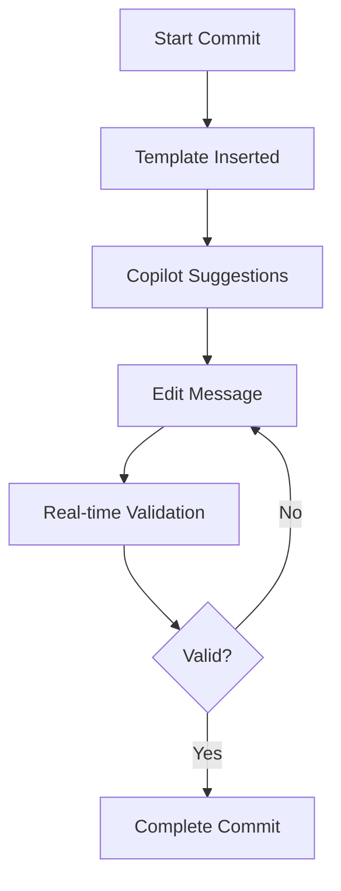

# Product Context

## Purpose
The Git Commit Message Manager (GCMM) solves the challenge of maintaining consistent, informative commit messages across a project by combining intelligent templates with GitHub Copilot's AI capabilities. It helps developers write better commit messages with less effort.

## Problem Space

### Current Challenges
1. **Inconsistent Formatting**
   - Variable message structure
   - Missing important details
   - Unclear impact scope
   - Poor categorization

2. **Manual Process**
   - Repetitive typing
   - Format memorization
   - Template copying
   - Error-prone validation

3. **Limited Context**
   - Missing technical details
   - Unclear user impact
   - Incomplete documentation
   - Lost change context

## Solution Approach

### Smart Templates
1. **Automatic Structure**
   - Conventional commits
   - Category organization
   - Emoji integration
   - Character constraints

2. **AI Enhancement**
   - Copilot suggestions
   - Context analysis
   - Impact assessment
   - Smart completions

3. **Real-time Validation**
   - Format checking
   - Content validation
   - Helpful feedback
   - Error prevention

## User Experience Goals

### Primary Objectives
1. **Efficiency**
   - Quick template access
   - Smart suggestions
   - Automatic formatting
   - Fast validation

2. **Quality**
   - Consistent structure
   - Complete information
   - Clear categorization
   - Useful context

3. **Learning**
   - Format guidance
   - Best practices
   - Error feedback
   - Example messages

### Usage Workflow

## Success Metrics

### User Impact
1. **Efficiency**
   - Reduced time per commit
   - Fewer validation errors
   - Quicker template access
   - Faster corrections

2. **Quality**
   - Consistent formatting
   - Complete information
   - Clear categories
   - Useful context

3. **Adoption**
   - Regular usage
   - Positive feedback
   - Feature requests
   - Community interest

## Integration Points

### Core Systems
1. **Git Integration**
   - Commit hooks
   - Message buffers
   - Status feedback
   - Command integration

2. **Copilot Integration**
   - Context gathering
   - Suggestion generation
   - Completion interface
   - Impact analysis

3. **Editor Integration**
   - Buffer management
   - Real-time validation
   - Keybindings
   - Status updates