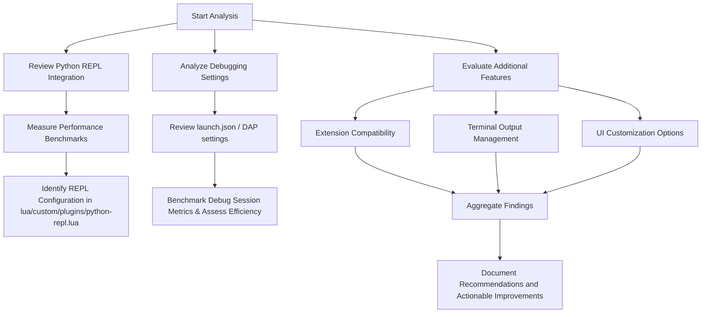

# Python IDE Configuration Analysis

## Overview
This document outlines the detailed analysis plan for the Python IDE configuration, focusing on integration and performance of the Python REPL, debugging settings, terminal output management, and UI customization options.

## Python REPL Integration & Performance
- **Benchmark Metrics:**
  - Startup time measurement
  - Memory consumption during initialization and usage
  - Command execution latency
- **Integration Analysis:**
  - Review configuration in `lua/custom/plugins/python-repl.lua`
  - Determine if the integration uses a dedicated extension or VSCode's built-in features
  - Evaluate performance-impacting parameters (e.g., auto-reload, caching)

## Debugging Settings & Development Efficiency
- **Configuration Review:**
  - Analyze VSCode's debugging settings (launch.json and DAP configuration via `lua/custom/plugins/dap.lua`)
  - Identify use of conditional breakpoints, log points, and custom debug adapters
- **Efficiency Recommendations:**
  - Propose optimization of debug log filtering to reduce noise
  - Suggest enabling/disabling specific debugging features based on development needs
  - Benchmark impacts on debug session performance and user efficiency

## Additional Features Enhancing the Coding Environment
- **Extension Compatibility:**
  - Review interoperability between the Python extension and additional tools like linters and formatters
- **Terminal Output Management:**
  - Assess VSCode terminal settings such as auto-scroll, font rendering, colorization, and output clarity
- **UI Customization Options:**
  - Analyze theming, layout, and panel arrangements for improved user experience
  - Document custom keymaps and UI tweaks applied via VSCode and Neovim lua configuration

## Workflow Diagram

## Next Steps
- Validate the benchmarks and recommendations noted above.
- Highlight actionable improvements and propose configuration adjustments based on the analysis.
- Use these findings to guide further optimization of the Python development environment.
- Implement documentation for shortcuts.