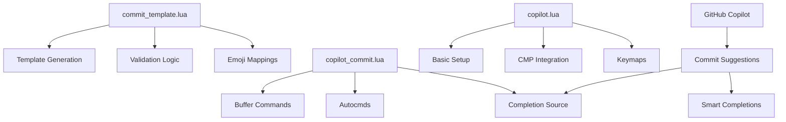

# System Patterns and Architecture

## Git Commit Message System

### Component Structure


### Core Patterns

1. **Template Management**
   - Centralized emoji mappings
   - Category-based organization
   - Validation rules as constants
   - Template generation functions

2. **Validation Strategy**
   - Pre-save validation
   - Real-time format checking
   - Warning-based approach
   - Clear error messaging

3. **Integration Points**
   - Autocmd-based initialization
   - Buffer-specific commands
   - nvim-cmp source integration
   - Which-key menu structure
   - Copilot suggestions integration
   - Smart completion context

4. **Error Handling**
   ```lua
   -- Pattern for validation results
   return valid, errors_table
   
   -- Pattern for notifications
   vim.notify(message, level)
   ```

5. **Buffer Management**
   ```lua
   -- Pattern for buffer-local operations
   local buf = vim.api.nvim_get_current_buf()
   vim.api.nvim_buf_set_lines(buf, start, end, false, lines)
   ```

6. **Completion Integration**
   ```lua
   -- Pattern for cmp source
   source = {
     name = 'name',
     priority = value,
     get_trigger_characters = function()
     complete = function(_, callback)
   }
   ```

### Design Decisions

1. **Modular Structure**
   - Separate template logic
   - Independent completion source
   - Isolated validation rules
   - Copilot integration layer

2. **User Experience**
   - Automatic template insertion
   - Non-blocking validation
   - Smart completions
   - Clear feedback
   - AI-assisted suggestions

3. **Performance Considerations**
   - Lazy loading where possible
   - Buffer-local operations
   - Cached emoji mappings
   - Efficient validation
   - Optimized Copilot calls

4. **Extensibility**
   - Configurable emoji maps
   - Customizable templates
   - Pluggable validation
   - Flexible categories
   - AI suggestion filters

### Testing Strategy

1. **Unit Tests**
   - Template generation
   - Message validation
   - Emoji mapping
   - Format checking
   - Copilot integration

2. **Integration Tests**
   - Autocommand behavior
   - Completion sources
   - Buffer operations
   - Command execution
   - AI suggestion quality

3. **Performance Tests**
   - Template generation speed
   - Validation efficiency
   - Completion responsiveness
   - Copilot response time