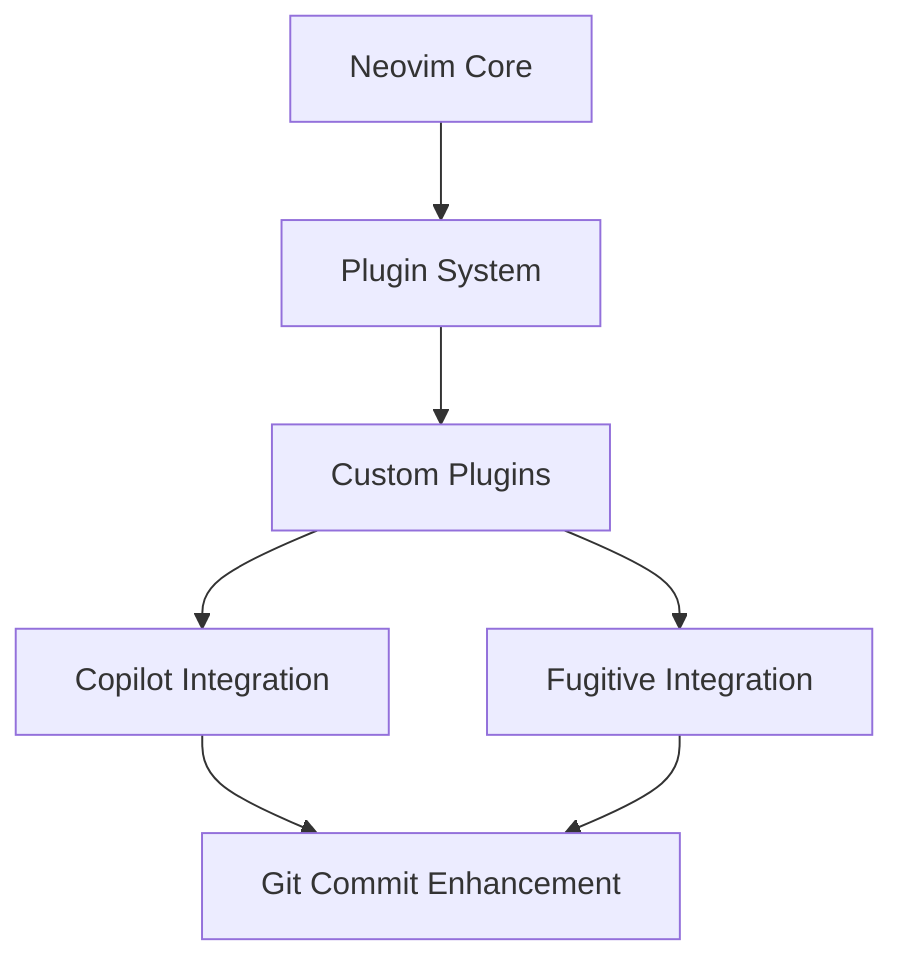

# System Patterns

## Architecture Overview

## Module Structure
- `lua/custom/plugins/`: Root plugin directory
  - `copilot.lua`: Core Copilot configuration
  - `keymaps.lua`: Centralized keybinding definitions
  - `git/`: Git-related functionality
  - `utils/`: Shared utilities

## Design Patterns
1. Event-Driven Architecture
   - Autocmd triggers for git operations
   - Buffer event handling
   - Status updates via events

2. Observer Pattern
   - Copilot status monitoring
   - Buffer state tracking
   - Configuration changes

3. Command Pattern
   - Keybinding implementations
   - Toggle functionality
   - Git operations

4. Factory Pattern
   - Buffer configuration creation
   - Status line component generation
   - Command registration

## Integration Patterns
1. Copilot Integration
   - Buffer-local activation
   - Context-aware suggestions
   - Status management

2. Fugitive Integration
   - Commit buffer detection
   - Command augmentation
   - Status synchronization

## Error Handling
1. Consistent Pattern
   - Clear error messages
   - Fallback behaviors
   - User notifications

2. Recovery Strategies
   - Configuration validation
   - Safe state restoration
   - Graceful degradation

## Performance Considerations
1. Lazy Loading
   - On-demand initialization
   - Deferred setup
   - Resource management

2. Event Optimization
   - Debounced operations
   - Efficient buffer handling
   - Minimal redraws

# Coding pattern preferences
   - Always prefer simple solutions
   - Avoid duplication of code whenever possible, which means checking for other areas of the codebase that might already have similar code and functionality
   - Write code that takes into account the different environments: dev, hlg, and prd
   - You are careful to only make changes that are requested or you are confident are well understood and related to the change being requested
   - When fixing an issue or bug, do not introduce a new pattern or technology without first exhausting all options for the existing implementation. And if you finally do this, make sure to remove the old ipmlementation afterwards so we don't have duplicate logic.
   - Keep the codebase very clean and organized
   - Avoid writing scripts in files if possible, especially if the script is likely only to be run once
   - Avoid having files over 200-300 lines of code. Refactor at that point.
   - Mocking data is only needed for tests, never mock data for dev or prd
   - Never add stubbing or fake data patterns to code that affects the dev or prd environments
   - Never overwrite my .env file without first asking and confirming