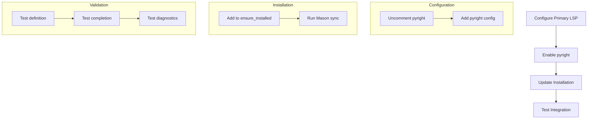
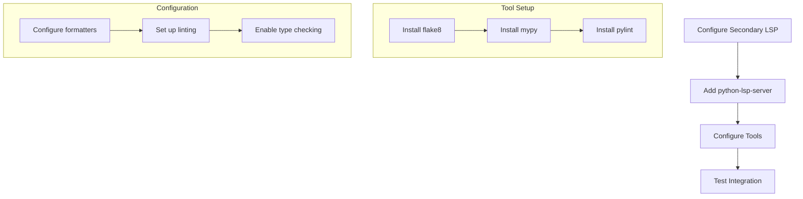

# Python LSP Setup Plan

## Current State
- Mason package manager is installed
- Python debugging is configured
- LSP configuration exists but Python support is commented out
- Error: "server does not support textDocument/definition"

## Dual LSP Implementation Plan

### Phase 1: Pyright Setup (Primary LSP)

#### LSP Configuration Location
```lua
-- Existing location in init.lua:
local servers = {
  -- pyright = {},  -- Currently commented out
}
```



### Phase 2: Python-LSP-Server Setup (Secondary LSP)



### Implementation Steps

#### Phase 1: Pyright Configuration
1. Modify servers table in init.lua
   ```lua
   local servers = {
     pyright = {
       settings = {
         python = {
           analysis = {
             autoSearchPaths = true,
             useLibraryCodeForTypes = true,
             diagnosticMode = "workspace"
           },
         },
       },
     },
   }
   ```

2. Ensure pyright is installed:
   ```lua
   local ensure_installed = vim.tbl_keys(servers or {})
   vim.list_extend(ensure_installed, {
     'stylua',
     'pyright',  -- Add pyright here
   })
   ```

#### Phase 2: Python-LSP-Server Configuration
1. Add python-lsp-server to servers:
   ```lua
   local servers = {
     pylsp = {
       settings = {
         pylsp = {
           plugins = {
             flake8 = { enabled = true },
             mypy = { enabled = true },
             pylint = { enabled = true },
           }
         }
       }
     }
   }
   ```

2. Add tools to ensure_installed:
   ```lua
   vim.list_extend(ensure_installed, {
     'python-lsp-server',
     'flake8',
     'mypy',
     'pylint'
   })
   ```

### Testing & Validation

1. Verify Installation
   - Run `:Mason` to check installations
   - Open a Python file to trigger LSP attachment
   - Check `:LspInfo` for proper server connections

2. Test Functionality
   - Go to definition (gd)
   - Show hover documentation (K)
   - View references (gr)
   - Check completion
   - Verify linting with flake8
   - Check type checking with mypy
   - Test pylint diagnostics

### Success Criteria
- [ ] Pyright server starts automatically
- [ ] Python-LSP-Server starts automatically
- [ ] Go to definition works properly
- [ ] Code completion is functional
- [ ] Hover documentation displays correctly
- [ ] Linting (flake8) provides feedback
- [ ] Type checking (mypy) works
- [ ] Style diagnostics (pylint) are active

### Rollback Plan
- Configuration is version controlled
- Can revert to commented state
- Mason can uninstall components
- Individual tools can be disabled

## Notes
- Using existing LSP configuration structure
- Following project's modular architecture
- Integrating with telescope for navigation
- Staged implementation for reliability